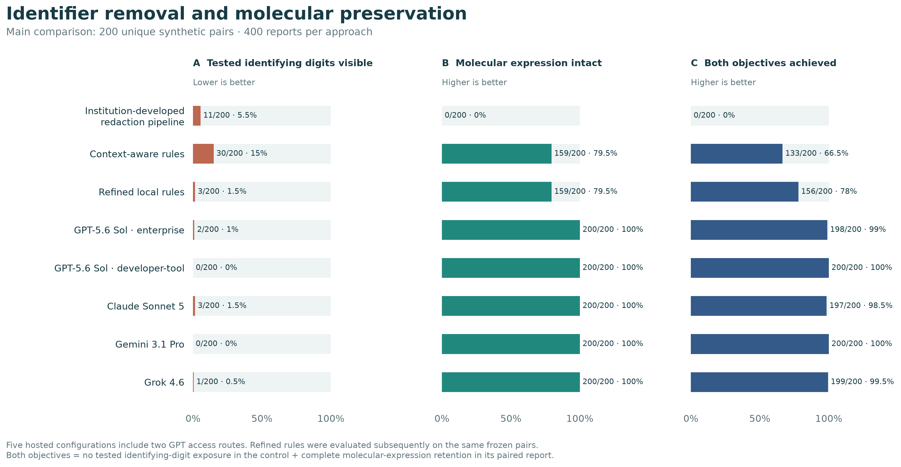
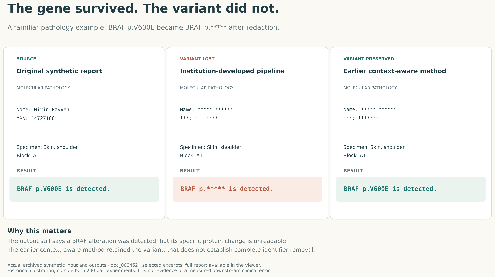

# Preserving molecular information during pathology report de-identification

**[Open the public research website](https://herndoch.github.io/pathology-deidentification-benchmark/)** | [Poster QR assets](poster/)

A synthetic methods benchmark: preserve the molecular expression in one report, remove a similarly formatted identifying value in its paired control.

**Open `index.html` for the illustrated research page and interactive report viewer.** It works directly from a downloaded folder without a server. All 400 unique pairs across the two separate experiments are inspectable, with original text and saved output side by side. No patient data are included.

## Main finding

In a selected and supplemented comparison of **200 unique pairs (400 reports)**, context-aware rules met both objectives in **133/200 pairs**; five hosted configurations met them in **197–200/200**. The institution-developed baseline preserved no complete tested molecular expressions. The hosted-versus-context comparisons had exploratory **adjusted p=0.16** after accounting for report patterns. The result is descriptive and does not establish real-world anonymity or general superiority.



In a separate **200-pair** local experiment, refinement reduced tested-digit exposures from **100/200 to 50/200**, retaining all molecular expressions. Parenthetical fields and modified identifier labels remained problematic. These cohorts are not pooled.



The separate local set was extended from 160 to 200 by adding five new pairs in each of eight existing patterns, with all original outputs and method code preserved. The BRAF figure is an earlier archived report, not one of these pairs.

## Reproduce the analysis

With Python 3, run:

```text
python audit/reproduce.py
```

The script uses only Python's standard library. No installation, account, credentials, model inference or network access is required. It checks file hashes, rescoring of all selected output strings, the seven main result rows, the six paired contrasts and Holm adjustments, and the separate local-refinement comparison. A successful run prints `"status": "PASS"`.

## Navigate the evidence

| File or folder | What it contains |
|---|---|
| [METHODS.md](METHODS.md) | Selection, endpoints, supplementation and limitations |
| [REVIEW_AND_LIMITATIONS.md](REVIEW_AND_LIMITATIONS.md) | Internal critique from clinical, informatics, molecular and statistical perspectives |
| [TECHNICAL_PROVENANCE.md](TECHNICAL_PROVENANCE.md) | Model labels, baseline attribution and exact scope of reproducibility |
| [CONFERENCE_READINESS.md](CONFERENCE_READINESS.md) | What has and has not been verified for USCAP |
| `data/main/` | 400 synthetic reports, annotations, 2,800 selected masks and scores |
| `data/local/` | 400 separate synthetic reports and 1,200 saved local masks |
| [data/worked_examples.json](data/worked_examples.json) | Corrected local failures, persistent failures and hosted failures selected for illustration |
| [data/provenance.json](data/provenance.json) | Per-record source-file hashes and collection source labels |
| `figures/` | PNG, SVG and PDF exports |
| [MANIFEST.json](MANIFEST.json) | SHA-256 file manifest |

## Interpretation and disclosure

The 200 main pairs are unique; no duplication rounds the denominator. They were selected for shared output availability, and missing/non-aligned Sonnet and Grok records underwent supplementary collection. The design does not separate model, access-route and batch-size effects. A zero on the narrow tested-digit endpoint is not comprehensive de-identification. The reports are deliberately constructed and not a clinical prevalence sample.

Synthetic generation, code, analysis, writing and internal review were AI-assisted. No independent specialist adjudication, external peer review, reader-comprehension study or downstream clinical benefit is claimed. The contribution is inspectable methods evidence, not an assertion that all local processing is futile. Authors remain responsible for final claims and submission.


## Matched refined rules and detailed lung illustration

The supplementary frozen refined method achieved both objectives on 156/200 of the same main pairs. All five LLM comparisons against refined rules have paired adjusted p<0.001; accounting for shared report patterns gives adjusted p=0.375. See [the supplement](data/refined_matched/METHODS.md) for complete methods and uncertainty. The original seven-arm results remain unchanged.

[Detailed lung report JPEGs and collage](lung/README.md) show two newly authored fictional reports and exact local redactions. These are illustrative only, not additional benchmark cases. The comparison now includes 3,200 main outputs plus 1,200 separate local outputs; the six new illustrative local outputs are kept separate.
